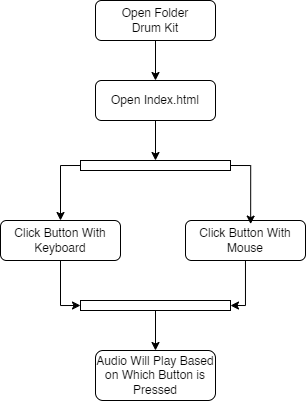

<h1 align="center" width="200px">
    Drum 🥁 Kit
</h1>

<h4 align="center">
    Play Audio Based on Button
     
    Press Button With Mouse - Press Button With Keyboard
</h4>

  <a href="#flowchart-diagram">Flowchart Diagram</a> •
  <a href="#key-features">Key Features</a> •
  <a href="#license">License</a> 

## Flowchart Diagram

    

## Key Features

* Button W
    - play tom-1 sound
* Button A
    - play tom-2 sound
* Button S
    - play tom-3 sound
* Button D
    - play tom-4 sound
* Button J
    - play snare sound
* Button K
    - play crash sound
* Button L
    - play kick bass sound

## License
> Instagram [@ryf.afn](https://www.instagram.com/ryf.afn) &nbsp;&middot;&nbsp;
> GitHub [@RifqiAfandi](https://github.com/RifqiAfandi) &nbsp;&middot;&nbsp;
> LinkedIn [@Rifqi Afandi](https://id.linkedin.com/in/rifqi-afandi-unej)
---